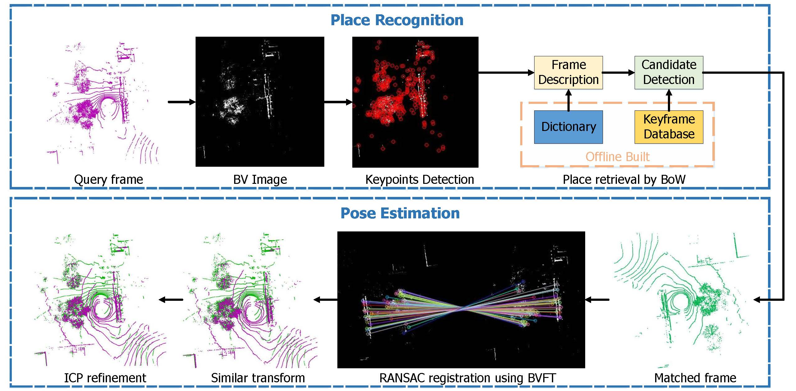

# BVMatch: Lidar-Based Place Recognition Using Bird's-Eye View Images

BVMatch is a LiDAR-based place recognition method that is capable of estimating 2D relative poses. It projects LiDAR scans to BV images and extracs BVFT descriptors from the images. Place recognition is achieved using bag-of-words approach, and the relative pose is computed through BVFT descriptor matching. 



## Dependencies

`OpenCV >= 3.3`

`Eigen`


## Example usage
Go to the "build" directory, run 

`cmake .. && make` 

`./match_two_scan ../data/xxx.bin ../data/xxx.bin`  

You will see the matching result of two LiDAR scans of the Oxford RobotCar dataset,


## Place Recognition Evaluation
#### 1. Download datasets 
Download the Oxford Robotcar dataset [here](https://pan.zju.edu.cn/share/055cb9be0d6715fddd195f5e25) (about 3.8GB) or from [google drive](https://drive.google.com/file/d/15M0FIHKeWvsMC1IgGpV_uVRrFnitT6t4/view?usp=sharing). Extract the foler on the project directory. Go to the `scripts` directory and change the `root_path` in `config.py` to the dataset path.

Note that all the following operations are under the `scripts` directory.

#### 2. Generate local descriptors
We extract the BVFT descriptors of each submap in advance for bag-of-words model training and global descriptor generation.

`python generate_local_descriptors.py`

The local descriptors are stored in the `local_des` folder on the corresponding sequence directory.


#### 3. Bag-of-words model training
We use the sequences collected in `2014` for training. (You may just skip this step since we have included the pre-trained model in this repo)

`python train_model.py`


#### 4. Generate pickle files
We use the sequences collected in `2015` for testing. We test the place recognition performance by retrivaling all the submaps in each sequence from all the other sequences. The retrival is successful when the ground turth distance between the query and the match is less than 25 meters. The ground truth correspondences are stored in the pickle files.

`python generate_test_sets.py`


#### 5. Evaluation
Generate global descriptors and perform evaluation. 

`python evaluate.py`

Note that this step may take hours since all the submaps in the sequences are evaluated. 


## Citation
Please cite this paper if you want to use it in your work,
```bibtex
@article{luo2021bvmatch,
  author={Luo, Lun and Cao, Si-Yuan and Han, Bin and Shen, Hui-Liang and Li, Junwei},
  journal={IEEE Robotics and Automation Letters}, 
  title={BVMatch: Lidar-Based Place Recognition Using Bird's-Eye View Images}, 
  year={2021},
  volume={6},
  number={3},
  pages={6076-6083},
  doi={10.1109/LRA.2021.3091386}
}
```


## Contact
Lun Luo

Zhejiang University

luolun@zju.edu.cn
